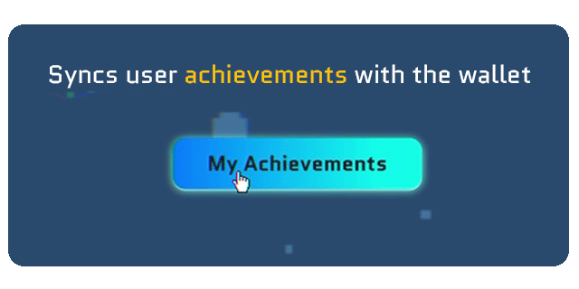

# 🚀 Project Title

[**NEXORA**](https://youtu.be/sZvwEnGwah8?si=bhwMyaRamyxyBSoQ) - An Arcade Game Built on **MONAD**.


---

## 📌 Problem Statement

**Problem Statement 2 - Unleash blockchain gameplay with Monad**

---

## 🎯 Objective

An engaging blockchain-powered game on **Monad** that delivers a fun and rewarding player experience.

By leveraging Monad’s smart contract capabilities, the game securely tracks in-game achievements on-chain. Players can **sync** their progress with their wallets, and the game offers a **high** replayability.

NEXORA demonstrates how blockchain, led by Monad, can elevate traditional gaming through trustless achievement systems and real-world incentives.

The game empowers both players and developers by combining fun platformer mechanics with real-world Web3 value.

---

## 🧠 Team & Approach

### Team Name:  
`Nexora`

### Team Members:  
- **Bandana Das** [[GitHub](https://github.com/bandana-web)] [[LinkedIn](https://www.linkedin.com/in/bandana-das-64b232291)] [UI Design & Asset Management]
- **Neha Soni** [[GitHub](https://github.com/NehaSoni25)] [[LinkedIn](https://www.linkedin.com/in/neha-soni-b47115290)] [Gameplay Logic]
- **Piyush Verma** [[GitHub](https://github.com/piyerx)] [[LinkedIn](https://linkedin.com/in/piyerx)] [Developer / Solidity Integration]
- **Priyanshu Agrawal** [[GitHub](https://github.com/Priyanshugrawal)] [[LinkedIn](https://www.linkedin.com/in/priyanshu-agrawal-83b268291)] [Frontend & Wallet Integration]


### Your Approach:  
- **Why you chose this problem?**

*Out of all the given problem statements and tracks, we found this one the most interesting as it was realted to games. We sat in a conference call discussing the PS, and everyone agreed on this one in fraction of second!*

*Creating a game, without any prioir experience was challenging, but we were here to have fun! And fun, we did.*

- **Key challenges you addressed?**

*We challenged ourselves to create a game totally on vanilla JS. We had to use Node.js for hardhat and stuff, but no React or external libraries were used for the game. The most challenging part was tilemapping, which includes placing and mapping collision blocks throughout the map.*

*Even the game assets like coins, sound effects, and background music were made by us. 100% from scratch. And we just loved doing it.*

- **Any pivots, brainstorms, or breakthroughs during hacking?**

*Since the brainstorming phase, we planned on using two tracks, MONAD and Screenpipe. Monad would handle transactions and Screenpipe would record the screen when an achievement was done. But during development, Screenpipe was unfortunately removed by the organisers due to some technical development issues. We proceeded with the MONAD track and completed the game.*

---

## 🛠️ Tech Stack

### Core Technologies Used:
- **Frontend:** HTML, CSS, JavaScript, Canvas API
- **Backend:** Node.js for Smart Contracts (Monad)
- **Database:** No traditional database → On-chain data via Monad Blockchain
- **APIs:** Monad JSON-RPC, Canvas API
- **Hosting:** Vercel for hosting the frontend static files | (Smart contracts are deployed on Monad testnet)

### Sponsor Technologies Used (if any):
- [ ] **Groq:** _How you used Groq_  
- [✅] **Monad:** _Your blockchain implementation_  
- [ ] **Fluvio:** _Real-time data handling_  
- [ ] **Base:** _AgentKit / OnchainKit / Smart Wallet usage_  
- [ ] **Screenpipe/Terminator:** _Screen-based analytics or workflows_  
- [ ] **Stellar:** _Payments, identity, or token usage_

---

## ✨ Key Features

Highlight the most important features of your project:

### ✅ Feature 1 : In-Game Achievements stored on-chain


### ✅ Feature 2 : Various screen ratios and browsers supported


### ✅ Feature 3 : Players can Sync their game progress via wallet


### ✅ Feature 4 : The game supports high Replayability 

---

## 📽️ Demo & Deliverables

- **Pitch Deck / PPT Link:** 

- **Demo Video Link:** https://youtu.be/sZvwEnGwah8?si=b4BqkfX9obJeF47k


- **Deployed Game Link:** https://nexora-game.vercel.app/


---

## ✅ Tasks & Bonus Checklist

- [✅] **All members of the team completed the mandatory task - Followed at least 2 of our social channels and filled the form** (Details in Participant Manual)  
- [ ] **All members of the team completed Bonus Task 1 - Sharing of Badges and filled the form (2 points)**  (Details in Participant Manual)
- [✅] **All members of the team completed Bonus Task 2 - Signing up for Sprint.dev and filled the form (3 points)**  (Details in Participant Manual)

---

## 🧪 How to Run the Project

### Requirements:
- Node.js

### Local Setup:
```bash
# Clone the repo
git clone https://github.com/piyerx/nexora.git

# Install dependencies
cd nexora-game

# Start development server
npm run dev

#Or you can directly open it Live Server
Right-click on index.html -> "Open with Live Server"
```

---

## 🧬 Future Scope

Here are some planned improvements and potential future enhancements for NEXORA:

🎮 **Expanded Gameplay:** Add new levels, character upgrades to enrich the core platformer experience.

🔗 **Multi-Chain Support:**
Integrate other chains like Polygon or Stellar for cross-chain achievements and rewards.

📦 **On-Chain Leaderboard:**
Record and display high scores directly on the blockchain tied to player wallets.

🛡️ **Smart Contract Security Audit:**
Conduct a formal audit for smart contract security and optimize gas usage for mainnet deployment.

🌍 **Localization & Accessibility:**
Add multi-language support and accessibility improvements for global reach.

📱 **Progressive Web App (PWA):**
Package the game as an installable web app for desktop/mobile devices.

---

## 📎 Resources / Credits

- 🧠 **APIs & Blockchain Tools**
  - [Monad Testnet](https://www.monad.xyz/) – For smart contract deployment and Web3 wallet interactions
  - [Ethers.js](https://docs.ethers.org/v5/) – Used for blockchain interactions on the frontend

- 🎮 **Open Source Libraries & Tools**
  - [Vercel](https://vercel.com/) – Hosting platform for the frontend
  - [Google Fonts – Quantico](https://fonts.google.com/specimen/Quantico) – For the game's display font
  - [VS Code Live Server](https://marketplace.visualstudio.com/items?itemName=ritwickdey.LiveServer) – Used for local development and preview

- 🎨 **Assets & UI**
  - [Piskel](https://www.piskelapp.com/) – For custom sprite and level creation
  - [Itch.io](https://itch.io/) – Free game art and pixel assets used in early builds

- 🙌 **Acknowledgements**
  - Special thanks to the **HackHazards 2025** team and mentors for organizing and guiding the hackathon
  - Shoutout to the **Monad** team for making Web3 development fun and frictionless
  - The open-source game dev community for sharing such incredible tools & resources ❤️

---

## 🏁 Final Words

We had so much fun creating this project. Keeping everything else aside, like college studies, we really emjoyed diving deeper into Web3 and working so hard that this project becomes a reality. 12-13 hours of hard work, daily for 8 days straight, and finally worth it at the end. We are not here to win, we are here to learn and have fun. We won't complain though if winning comes to us as a by-product :)

And with more hackathons to come, NEXORA WILL GO FURTHER THAN THIS.

~Thank You.

